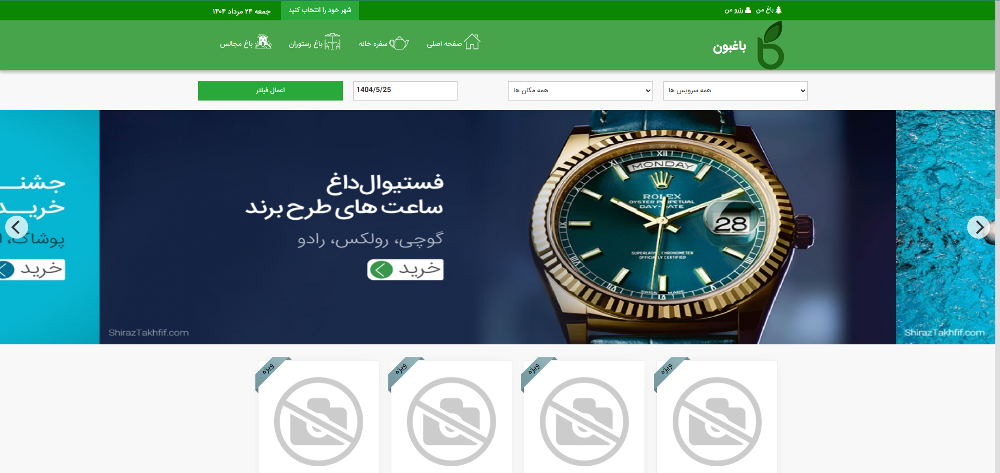
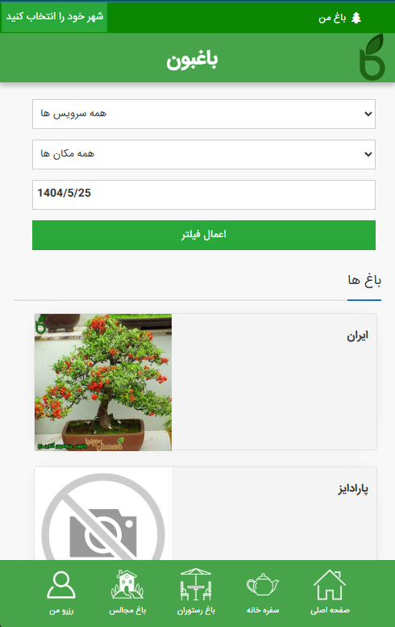
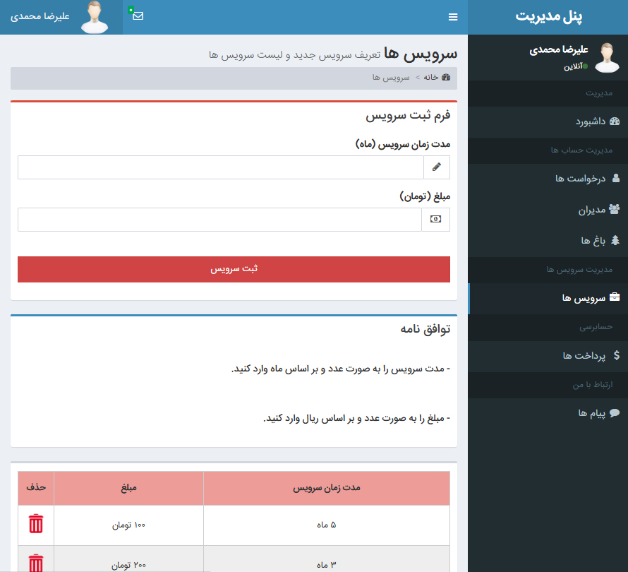

# 🌿 Baghebon – Online Garden & Venue Reservation System

**Baghebon** is an online reservation platform for booking **wedding gardens, banquet halls, and garden restaurants**.  
Garden owners can register, pay a membership fee via **online payment gateway**, and showcase their venues to potential customers.  
Visitors can browse the listed gardens, view details, and make reservations easily.  
The system also supports **HTML email notifications** and **SMS alerts** for bookings and updates.

---

## ✨ Features
- 🏡 **Garden Listing** – Owners can add and manage their venues.
- 📅 **Online Booking** – Customers can book any available garden they like.
- 💳 **Payment Gateway Integration** – Secure online payments for membership and booking fees.
- 📧 **HTML Email Notifications** – Beautifully formatted booking and registration emails.
- 📲 **SMS Notifications** – Instant alerts for bookings and important updates.
- 🔒 **User Authentication** – Secure login for both owners and administrators.
- 📱 **Responsive Design** – Works perfectly on desktop, tablet, and mobile.
- ⚙ **Admin Panel** – Manage users, bookings, and garden listings.

---

## 🗄 Database
The SQL Server database is included in the **`SQL`** folder.  
Import it into SQL Server Management Studio to use the project.

---

## 🔑 Admin Login
**URL:** `Admin/managementsignin`  
**Email:** `ali@gmail.com`  
**Password:** `1234`  

---

## 🖼 Screenshots

### 🖥 Desktop View – Main Page

### 📱 Mobile View – Main Page

### ⚙ Admin Panel

---

## 🛠 Technologies Used
- **ASP.NET WebForms**
- **C#**
- **SQL Server**
- **HTML, CSS, JavaScript**
- **Bootstrap** (Responsive UI)
- **Payment Gateway API**
- **SMTP (HTML Email)**
- **SMS API**

---

## 📌 How to Run
1. Clone or download this repository.
2. Import the database from the `SQL` folder into SQL Server.
3. Configure the connection string in `Web.config` to match your SQL Server settings.
4. Configure **payment gateway**, **SMTP**, and **SMS API** credentials in the project settings.
5. Run the project in Visual Studio.
6. Login as admin using the credentials above or create a new user account.

---

> 🌱 *Baghebon – making event venue booking simple, fast, and accessible for everyone.*
